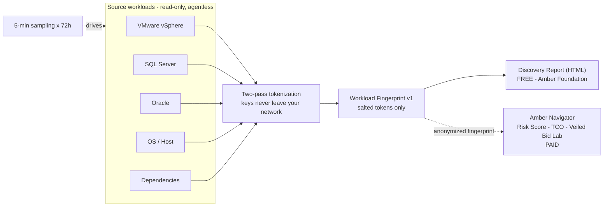

# Amber Lens

**The open-source migration discovery scanner.** Local-first, read-only,
agentless. Amber Lens reads what you actually run — VMware, SQL Server, Oracle,
OS, and dependencies — and produces a transparent **Discovery Report** plus a
versioned **Workload Fingerprint**, in 72 hours, without agents and without your
data leaving your network.

> Part of the Amber Cloud platform. The Lens (Foundation) is free and
> open-source forever — we monetize the *insight* (risk scoring, TCO, the Veiled
> Bid Lab in Amber Navigator), never your data.

## Why it's different

- **Speed** — a 72-hour, 5-minute-interval read (~95% confidence), not a 30-day agent rollout.
- **Transparency** — read-only, agentless, open-source, two-pass tokenization. Every query is listed in [`docs/what-we-read.md`](docs/what-we-read.md).
- **Depth** — database editions/licensing (incl. Oracle options/packs), dependencies, and performance — not a static inventory.
- **Neutrality** — destination-neutral output; serves an objective rehost / replatform / refactor / repurchase / retire decision regardless of target cloud.

## Free vs. paid

The Lens and the local **Discovery Report** (inventory, configuration, OS/EOL,
optimization & right-sizing recommendations) are **free**. The scored analysis —
Operational Risk Score, detailed TCO, multi-cloud what-if, and the Veiled Bid
Lab — is the paid **Amber Navigator** layer and lives in a separate repo.

## Quickstart

```bash
make build
./bin/amber-lens
```

## Layout

```
cmd/amber-lens      single-binary entrypoint
internal/collectors vmware · sqlserver · oracle · osmeta · deps (read-only)
internal/fingerprint Workload Fingerprint v1 (freeze by July 1)
internal/tokenize    two-pass tokenization (keys stay local)
internal/sampling    5-min × 72h scheduler
internal/report      Discovery Report (HTML) generator
pkg/schema           public fingerprint JSON Schema
profiles             open-source collector profiles (community/vendor)
docs                 architecture · fingerprint-schema · what-we-read
```

## Architecture



## Privacy

**Zero telemetry. Ever.** Amber Lens emits no analytics, no pings, no usage data.

## Contributing

See [CONTRIBUTING.md](CONTRIBUTING.md). All contributions are Apache-2.0 and must
be read-only, agentless, and destination-neutral.

## License

[Apache-2.0](LICENSE).
